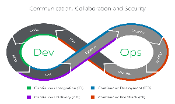
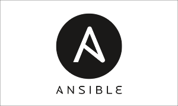

# HARVEST CORP

Harvest Corp merupakan perusahaan yang bergerak di bidang e-commerce penjualan berbagai alat dan mesin pertanian.

Pada mulanya Harvest Corp masih mengusung arsitektur monolitik, yang mana kekurangannya adalah sulit melakukan perubahan dan maintenance pada aplikasinya. 

Selain itu untuk servernya sendiri masih menggunakan server on premise. Kita tahu bahwa untuk model ini membutuhkan biaya investasi yang besar untuk inventorynya, pemasangan yang harus di client system, dan yang jelas membutuhkan tim IT profesional untuk mengelolanya.

Kemudian setelah rapat diadakan menghasilkan keputusan bahwa mereka akan akan meng-hire seorang devops engineer. Di sinilah peran saya sebagai seorang devops engineer, mulai menyarankan perusahaan untuk beralih dari monolitik ke arsitektur microservices. Selain aplikasinya yang scalable, secure dan reliable, setiap service memiliki infrastruktur sendiri. Jadi, lebih mudah dalam membuat atau memperbarui aplikasi tanpa memikirkan hubungan/ketergantungan module dengan service yang lain, sehingga update dan maintenance menjadi lebih cepat dan mudah.

Kemudian mengganti server agar memakai Cloud Computing, dan juga saya akan menerapkan pendekatan kultur devops sebagai berikut ;

1. Plan  
   Tahap rencana mencakup semua yang terjadi sebelum developer mulai menulis kode. Tool yang digunakan adalah JIRA SOFWARE, merupakan salah satu aplikasi yang dapat mendukung pekerjaan dan penjadwalan dengan baik.
   
 

2. Code  
   Tahap dimana developer team mulai melakukan coding sesuai plan yang telah dibuat. Di sini tool yang digunakan adalah GitHub
   
 

1. Build  
   Merupakan tahap membangun aplikasi, developer team mulai melakukan penggabungan berbagai macam code yang sudah dilakukan. 
 

4. Test  
   Tahap melakukan pengetesan pada aplikasi yang sudah dibuat.
 

5. Release  
   Pada tahap ini aplikasi siap untuk ditempatkan di lingkungan produksi. Pada tahap ini, setiap perubahan kode telah melewati serangkaian tes manual dan otomatis. 
 

6. Deploy  
   Tahap di mana aplikasi sudah siap dirilis ke produksi.
 

7. Operate  
   Aplikasi sudah rilis dan bisa digunakan oleh customer. Kini tim operasi bekerja keras, memastikan bahwa semuanya berjalan lancar.
 

8. Monitor  
   Tahap terakhir dari workflow DevOps yakni pemantauan aplikasi.

Workflow di atas juga sama dengan konsep CI/CD (Continuous Integration/Continuous Deployment) berikut ini

 

### Selain itu alat-alat yang digunakan antara lain ;

* **Jenkins**  
  adalah server otomatisasi open source, membantu mengotomatiskan bagian-bagian pengembangan perangkat lunak yang terkait dengan build, testing dan deploy lalu dapat melakukan proses yang berkelanjutan.
  
 

* **Ansible**  
  sebuah open-source software yang dapat digunakan untuk mengotomatiskan banyak proses, seperti pembuatan infrastruktur, manajemen konfigurasi, dan deployment aplikasi.  
  
 

* **Docker**  
  platform perangkat lunak yang memungkinkan Anda membuat, menguji, dan menerapkan aplikasi dengan cepat.
  
 

* **Amazon Web Services**  
  merupakan penyedia layanan cloud yang aman, dan bisa memilih produk sesuai kebutuhan.
  
 

* **Kubernetes**  
  platform open source untuk mengelola kumpulan kontainer satu sama lain.
  
 

* **Grafana & Prometheus**  
  Tool yang berfungsi untuk memantau apakah aplikasi berjalan dengan semestinya.
  
 

* **IP Address**  
  IP Public di sini saya gunakan untuk mengakses web dan aplikasinya, sedangkan IP Private saya gunakan untuk berkomunikasi antara web server, database server ataupun storage server agar lebih aman.
 

* **Domain**  
  Domain sendiri saya memutuskan untuk menyewa di connectindo.id dengan nama harvest.id. 
  
