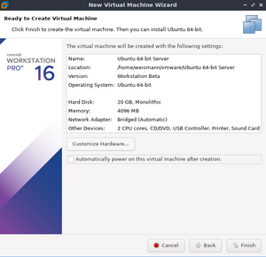
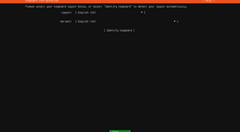

# Instalasi Ubuntu Server via VMWare Workstation

1. Pertama download dahulu VMWare Workstation dan Ubuntu Server.

2. Kemudian ubah permissions dari file VMWare Workstation, centang kotak "Make the file executable", klik OK.  
      
      

3. Jalankan perintah instalasi pada terminal.  
      
Tunggu proses intalasi  
      

4. Langkah berikutnya pilih "accept" kemudian klik "next" dan pilih "no" saja.  
     
      
      

5. Instalasi VMWare Workkstation sudah selesai.  
      

6. Berikutnya adalah langkah instalasi ubuntu servernya. Klik "Create a new virtual machine"  
      

7. Untuk konfigurasinya pilih "Typical", klik Next.  
      

8. Kemudian browse file Ubuntu Server yang berformat .iso, klik Next.  
      

9. Langkah berikutnya pilih OS dan versinya, klik Next.  
      

10. Lalu isikan nama dan lokasinya, klik Next.  
      

11. Selanjutnya untuk disk size isikan 20 GB atau sesaui rekomendasiannya dan pilih "Store virtual disk as a single file", klik Next.  
      

12. Kemudian anda bisa melakukan customize hardware, di sini saya akan mengubah network adapternya menjadi bridged.  
      
      

13. Instalasi Ubuntu Server siap dijalankan, klik "Start up this guest operating system".  
      
    
14. Pilih bahasa sesuai keinginan.  
      

15. Untuk pemilihan layout keyboard, kita biarkan default saja, [Done]  
      

16. Kemudian untuk network connections, di sini saya akan membuatnya menjadi static, automatic DHCP kita ganti manual.  
      

17. Edit IP configurationnya. [Save]  
      

18. Kini IP Addressnya sudah menjadi static. [Done]  
      

19. Untuk proxy address kosongkan saja, [Done]  
      

20. Untuk mirror address, biarkan default saja, [Done]  
      

21. Untuk guided storage dan system summary, langsung [Done] saja.  
      
      

22. Kemudian isikan profil setup, [Done]  
      

23. Pilih "Isntall OpenSSH", [Done] tunggu hingga proses instalasi selesai.  
      
      
      