# Basic Linux Commands

1. Mencari path dari direktori yang anda gunakan saat ini.

         pwd
        

2. Membuat folder baru.
         
         mkdir <nama-folder>
      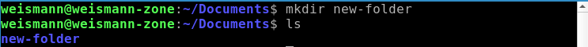

   Contoh membuat beberapa folder sekaligus.
   
         mkdir <nama-folder nama-folder2 nama-folder3>
   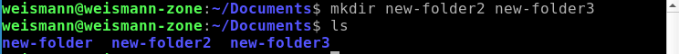  

3. Melihat isi dari direktori.

         ls
      

   Berikut contoh menampilkan file atau folder hidden. 

         ls -la
      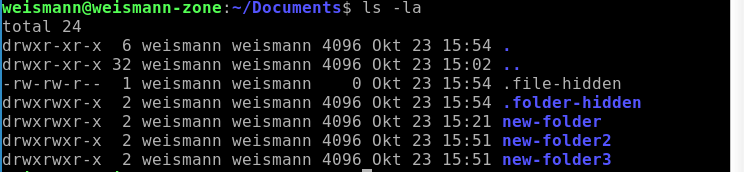  

4. Masuk ke dalam direktori atau folder menggunakan cd.

         cd <nama-directory/folder>
        

   Keluar dari current directory ke parent directory.

         cd ..
      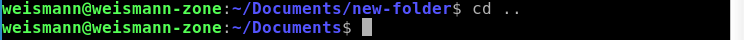  

5. Copy file.

         cp <file-lama> <file-baru>
      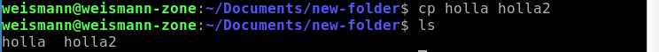  

   Untuk meng-copy folder dan semua isinya.

         cp -r <folder-lama> <folder-baru> 
      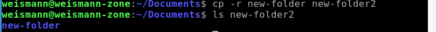  

6. Membuat file.
   
         touch <nama-file>
      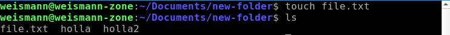  

7. Melihat isi sebuah file.

         cat <nama-file>
        

8. Menghapus file.

         rm <nama-file>
      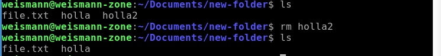

   Menghapus folder dan beserta isinya.

         rm -r <nama-folder>
      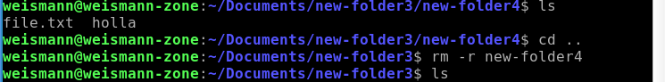  

9.  Memindah/rename file atau folder.

         mv <file/foldr-lama> <file/folder-baru>
      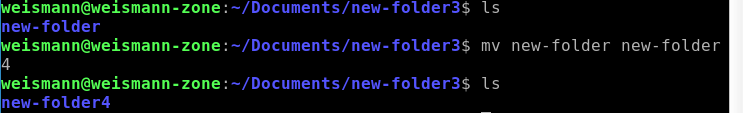  

10. Mencari berbagai jenis file menggunakan perintah find.
        Anda dapat menggunakan deskriptor berikut untuk menentukan jenis file.
    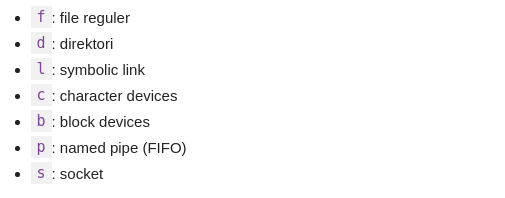

         find </your/path -type f -name nama-file>
      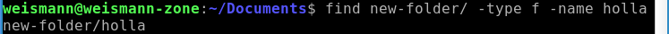  

11. Mencari pattern atau kata pada sebuah file text yang sudah dibuat.

         grep <text yang dicari> <nama-file>
      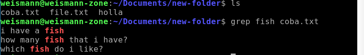  

12. Perintah yang memungkin anda untuk menjalankan program sebagai superuser atau pengguna lain.
    
         sudo <execution command>
      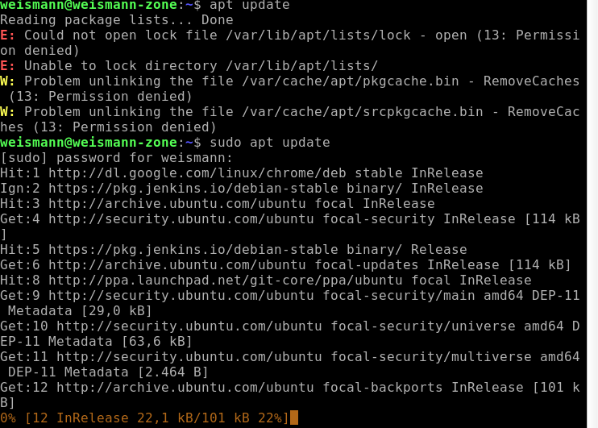  

13. Membuat user baru.

         sudo adduser <nama-user-baru>
        

14. Berganti user.

         su <nama-user>
      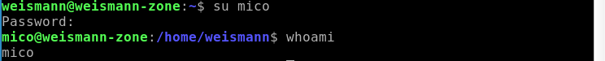  

15. Menghapus user.
    
         sudo deluser <nama-user>
      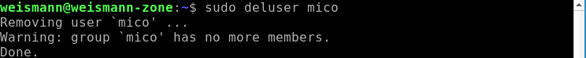  

16. Memberikan hak akses superuser pada user lain.

         sudo usermod -aG <group> <user>
      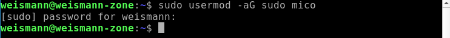  

17. Memberikan mode (hak akses) file dan direktori.

         sudo chmod <mode> <file atau folder>
      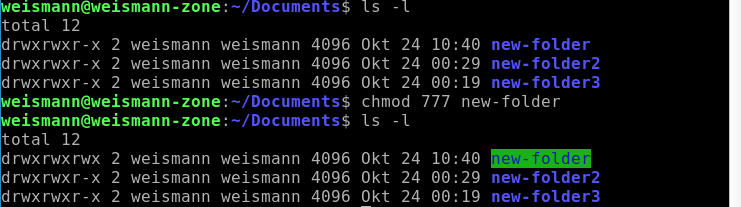  

18. Memberikan hak akses file atau folder pada user lain

         sudo chown <options> <user:group> <nama-file/folder>
      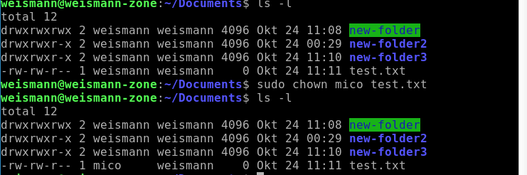  

19. Menghapus user.

         sudo deluser <nama-user>
        

20. Mengecek koneksi server.

         ping <server>
      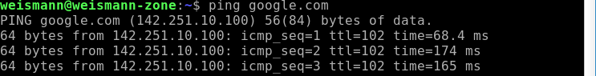  

21. Review atau melihat command yang pernah dipakai.

         history
      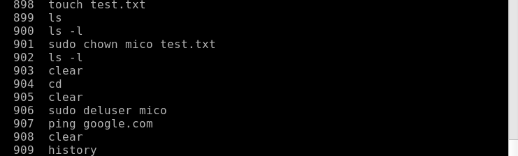  

22. Mengompres dan mengekstrak file.

         zip -r <archivename.zip> <file to zip>
      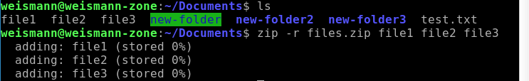

         unzip <archivename.zip>
      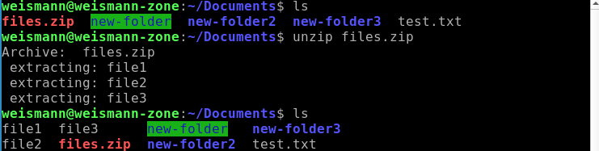  

23. Mengetahui nama host/network, juga melihat IP address dengan menambahkan -i atau -I di akhir command.

         hostname -i
            atau
         hostname -I
      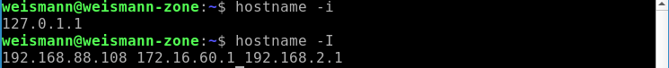  

24. Salah satu fungsi command echo adalah memindahkan beberapa data ke dalam satu file, di sini saya contohkan menambahkan teks.

         echo <teks> >> <file.txt>
      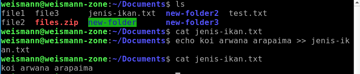  

25. Membersihkan jendela terminal.

         clear
      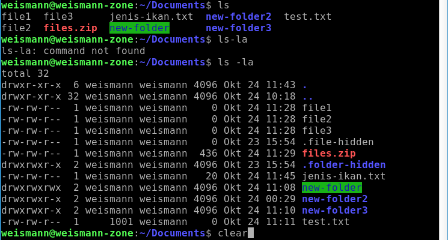
   

    
