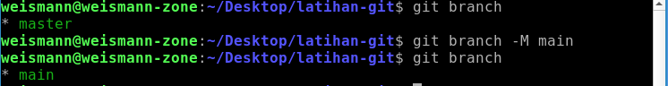
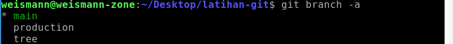

# Version Control System

1. Membuat repositori lokal.

        git init
    
      

2. Menambahkan file atau folder ke repository.

        git add <nama-file>
    

   Menambahkan file dengan berdasarkan ekstensinya.

        git add *.<file-ekstensi>
    

   Menambahkan keseluruhan file dan folder.

        git add .
      

3. Menghapus file dari repositori.

        git rm --cached <nama-file>
    

   Menhapus folder yang berisi banyak file.

        git rm --cahced <nama-folder>/ -r
      

4. Melihat status file atau folder pada repositori lokal.

        git status
      

5. Membuat commit pada repositori.

        git commit -m <pesan>
      

6. Membuat branch baru atau me-rename baranch yang sudah ada.

        git branch -M <nama-branch-baru>
    

   Melihat branch yang sudah dibuat.

        git branch -a
      

7. Berpindah ke branch lain.

        git checkout <nama-branch>
      

8. Menambahkan repositori ke Github.

        git remote add <nama-remote> <url-remote>
    

   Mengubah nama remote.

        git remote rename <nama-remote-lama> <nama-remote-baru>
      

9. Mengirim/memasukkan ke Github
    
        git push <nama-remote> <nama-branch>
      

10. Mengambil repositori dari Github.

        git pull <nama-remote> <nama-branch>
      

11. Meng-copy repositori dari remote ke lokal

        git clone <url-remote> [nama-dir] 
        (opsional nama direktori yang akan dibuat. Jika kita tidak berikan nama direktori, maka akan otomatis menggunakan nama repositori)
    

