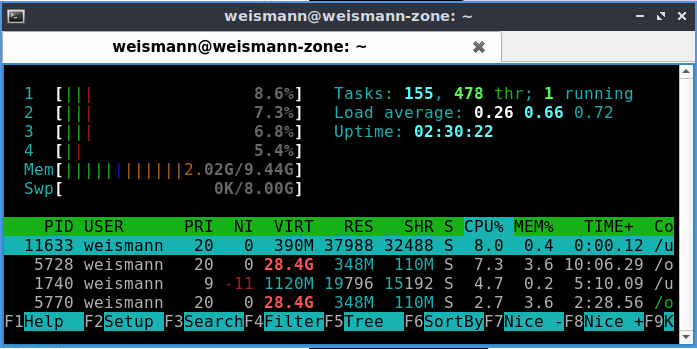
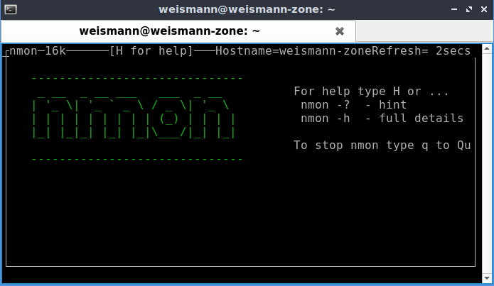
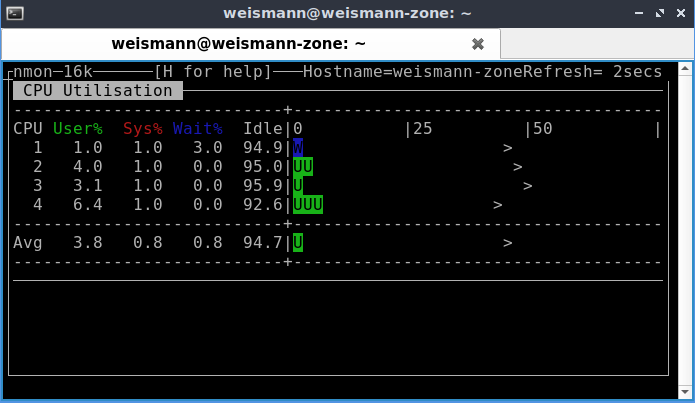
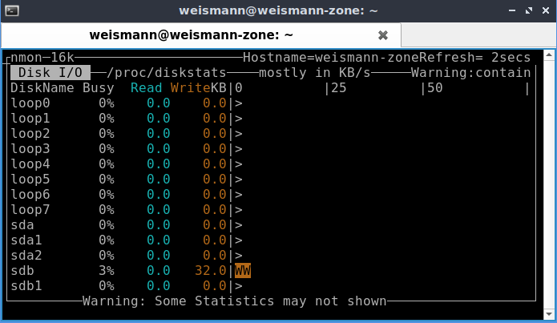
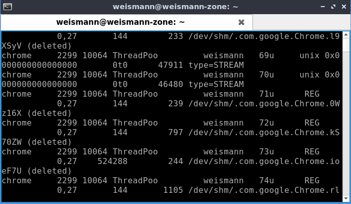
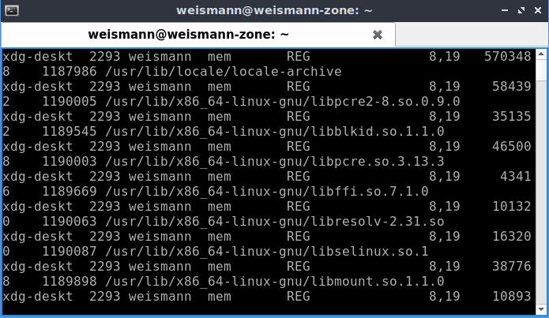
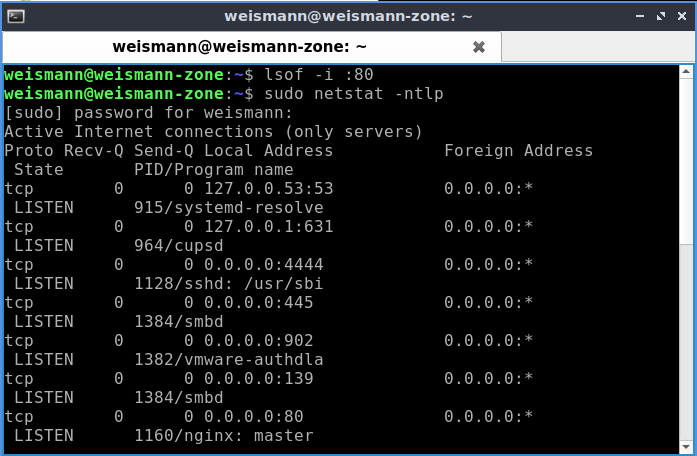
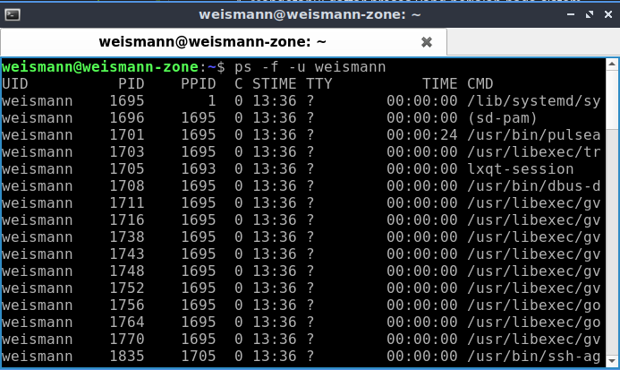
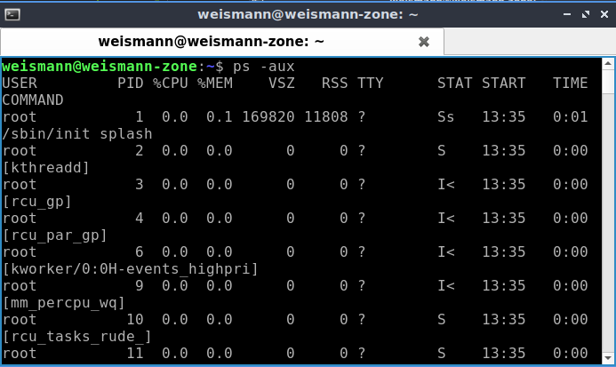

# **Monitoring**

1. Perintah untuk memonitoring sistem, kita dapat melihat penggunaan memory, cpu, swap.

        htop
      

2. Selain htop, bisa juga menggunakan NMON untuk melihat performa sistem.

        nmon (kemudian tekan c untuk melihat performa cpu)
      
      

        ketik d untuk melihat disk.
      

3. Melihat seluruh file yang terbuka berdasarkan proses aktif yang berjalan di sistem.

        lsof
    

   Menampilkan proses yang dilakukan oleh user

        lsof -u <nama-user>
    

   Menampilkan proses yang menggunakan port.

        lsof -i :<port>
      

4. Mengetahui daftar proses yang berjalan pada sistem.

        ps -f -u <nama-user>
    

   Menampilkan seluruh proses secara lengkap.

        ps -aux
      