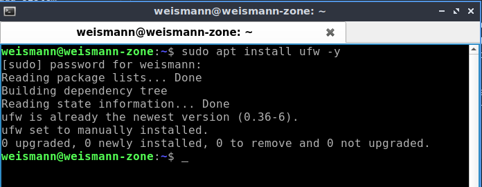
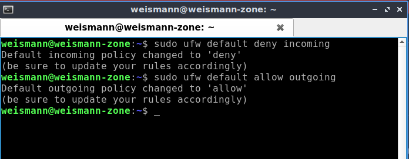
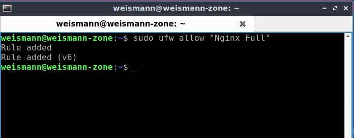
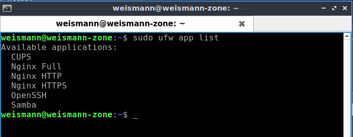
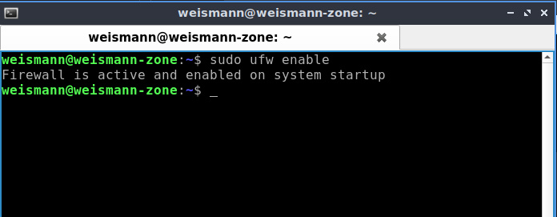
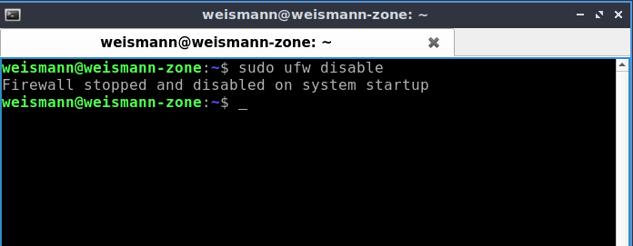
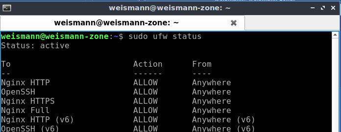

# **Network Firewall**

Iptables merupakan salah satu tools firewall pada sistem operasi Linux. Fungsi iptables adalah mengamankan jaringan dengan melakukan penyaringan trafik pada server. Selain mengatur lalu lintas jaringan, anda juga mampu mengelola jenis paket yang dapat diterima, mengatur trafik berdasarkan asal dan tujuan data, mengelola port, dan lainnya.  

Ufw adalah singkatan dari Uncomplicated Firewall sebuah aplikasi front-end dari iptables yang ringan, powerful dan sangat mudah digunakan untuk mengatur firewall.  

* Melakukan instalasi ufw, jalankan perintah berikut :

        sudo apt install ufw -y
      

* Memblokir semua akses yang masuk

        sudo ufw default deny incoming
    

* Membuka semua akses yang keluar

        sudo ufw default allow outgoing
      

* Kemudian buka beberapa port umum seperti ssh, https, dll. 

        sudo ufw allow "OpenSSH"
        sudo ufw allow "Nginx Full"
      

* Selain itu anda bisa cek sendiri aplikasi apa saja yang ada di daftar UFW dengan perintah berikut :

        sudo ufw app list
      

* Mengaktifkan firewall.

        sudo ufw enable
      

* Menonaktifkan firewall.

        sudo ufw disable
      

* Mengecek status firewall

        sudo ufw status
      

