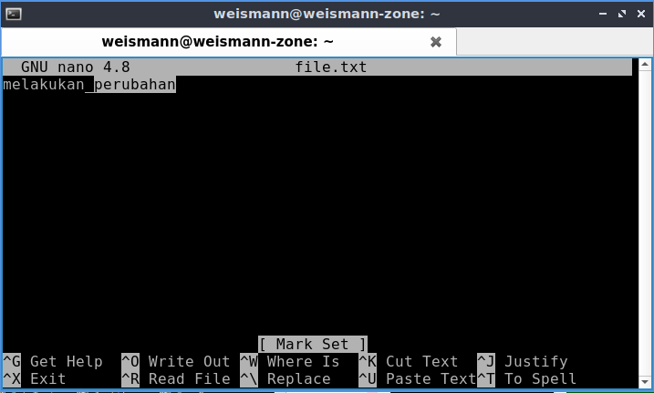

 # **Text Editor With Nano**

1. Pertama bukalah file dengan nano. ketik nano <file.txt>   kemudian ketikan beberapa kata lalu simpan dan tutup aplikasi nano.

        ctrl + x
      

2. Cara menyimpan tanpa menutup aplikasi nano.

        ctrl + o
      

3. Mencari text yang kita inginkan dengan mengetikkan value di dalamnya.

        ctrl + w
      

4. Memilih text yang akan diedit.

        alt + a
      

5. Melakukan copy paste.

        alt + 6 (untuk copy)
        ctrl + u (untuk paste)
      

6. Melakukan cut dan paste.

        ctrl + k (untuk cut)
        ctrl + u (untuk paste)
      

7. Memindahkan cursor ke baris awal.

        ctrl + a
      

8. Memindahkan cursor ke baris akhir.

        ctrl + e
      
    
9. Melakukan undo.

        alt + u
      

10. Melakukan redo.

        alt + e
      

11. Berpindah cursor dengan memasukkan value untuk kolom dan barisnya.

        ctrl + /
            or
        ctrl + _
      

12.  Mereplace text.

        ctrl + \
      
