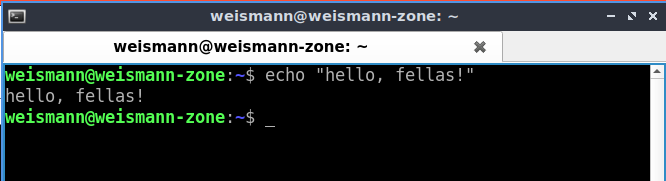
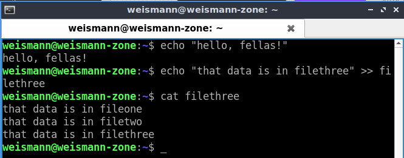

# **Text Manipulation**

1. Melihat konten atau isi file.

        cat <nama-file>
    

   Membuat file beserta isinya.

        cat > <file-isi>
    

   Mengaabungkan isi file.

        cat <nama-file1> <nama-file2> > <nama-file3>
      

2. Memanipulasi teks dasar pada file.

        sed -i 's/<teks-awal>/<teks-pengganti>/g' <nama-file>
      

3. Melakukan pencarian sebuah kata pada sebuah file yang sudah dibuat.

        grep <kata> <nama-file>
    

   Menghitung jumlah kata yang dicari.

        grep -c <kata> <nama-file>
    

   Menampilkan semua file yang berisikan kata yang dicari.

        grep <kata> *
      

4. Mengurutkan data secara ascending.

        sort <nama-file>
    

   Mengurutkan secara descending.

        sort -r <nama-file>
      

5. Menambahkan/mencetak string atau pesan.

        echo <"kata yang ingin dicetak">
    

   Menambahkan string atau pesan pada file.

        echo <"kata yang akan ditambahkan"> >> <nama-file>
    

   Mengganti semua isi data pada suatu file.

        echo <"kata yang akan digunakan sebagai pengganti"> > <nama-file>
      

6. Mencetak baris pertama (10 baris secara default) dari satu atau lebih file.

        head <nama-file>
    

   Menampilkan jumlah baris tertentu.

        head -n <nama-file>
      

7. Menampilkan bagian terakhir.

        tail <nama-file>
      
    

   Menampilkan jumlah baris tertentu.

        tail -n <nama-file>
      

8. Menampilkan konten atau file dari suatu perintah dalam satu halaman.

        less <nama-file>
      
      

9. Mencari perbedaan antara dua buah file.

        diff <nama-file1> <nama-file2>
      