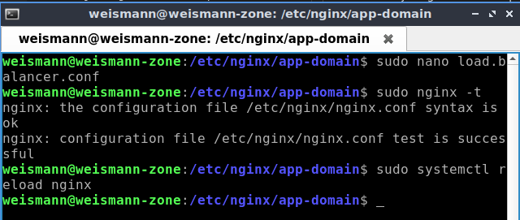
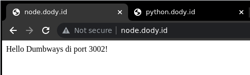

# **Load Balancing**

adalah proses pendistribusian traffic jaringan ke beberapa server. Ini untuk memastikan salah satu server tidak menanggung terlalu banyak beban permintaan. 

1. Di sini saya memakai contoh aplikasi sederhana node.js sebelumnya dan saya tambahkan menjadi 3 apps (index.js).   
     

2. Untuk konfigurasinya, kita buat seperti ini ;   
    

3. Kemudian cek konfigurasinya dan reload nginx.

        sudo nginx -t
        sudo systemctl reload nginx
      

4. Berikut adalah hasilnya.   
       
       
      