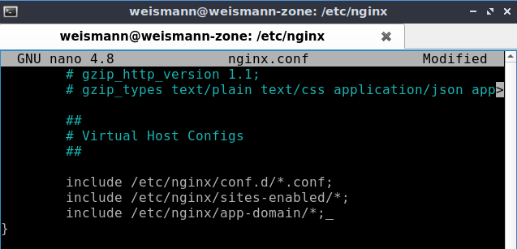
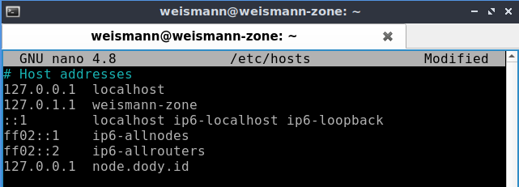

# **Reverse Proxy**

adalah konfigurasi standar yang digunakan untuk mengubah jalur trafic, misal aplikasi menggunakan port 5000 tetapi agar dapat diakses melalui port 80 maka haruns menggunakan reverse proxy.

Untuk webserver, silakan Anda install Nginx dan jalankan. pastikan Nginx run well.   
  

## Menjalankan aplikasi di web server

1. ***Node app***

   * Pertama silakan nyalakan pm2
   
         pm2 start myapp-nodejs/index.js
        

   * Lalu buat folder di /etc/nginx.

         sudo mkdir app-domain (nama folder)
        
      
   * Pindah directory ke app-domain, lalu buat file confignya.

         sudo nano nodejs.dody.conf
        

   * Tambahkan folder yang sudah dibuat tadi ke dalam file nginx.conf agar config yang sudah dibuat dapat terbaca oleh nginx.

         sudo nano nginx.conf
        

   * Kemudian cek apakah config kita berhasil.

         sudo nginx -t
        

   * Lalu silakan reload nginx.

         sudo systemctl reload nginx
        

   * Karena kita tidak mempunyai server, maka untuk lokal harus menambahkan subdomain di /etc/hosts agar seolah kita mempunyai domain.

         sudo nano /etc/hosts
      
   
   * Berikut adalah hasilnya   
         

2. ***Python***

   - Pertama silakan nyalakan pm2 
  
         pm2 start python-app/index.py
        

   - Pindah directory ke app-domain, lalu buat file confignya.

         sudo nano python.dody.conf
        

   - Kemudian cek apakah config kita berhasil.

         sudo nginx -t
        

   - Lalu silakan reload nginx.

         sudo systemctl reload nginx
        

   - Seperti halnya pada praktik sebelumnya, tambahkan sub domain ke /etc/hosts

         sudo nano /etc/hosts
      

   - Berikut hasilnya.   
         

3. ***Go***

  * Untuk Go, nyalakan dahulu nohup.

      nohup ./index &
     

  * Pindah directory ke app-domain, lalu buat file confignya.

         sudo nano go.dody.conf
        
  
  * Kemudian cek apakah config kita berhasil.

         sudo nginx -t
        

  * Lalu silakan reload nginx.

         sudo systemctl reload nginx
        

  * Seperti halnya pada praktik sebelumnya, tambahkan sub domain ke /etc/hosts

         sudo nano /etc/hosts
        

  * Hasilnya sebagai berikut.   
        
      

