# **PM2**

adalah sebuah package process manager dari Keymetrics yang bertujuan agar project NodeJS dapat berjalan terus menerus.

1. Pertama-tama install dulu pm2

        npm install pm2
    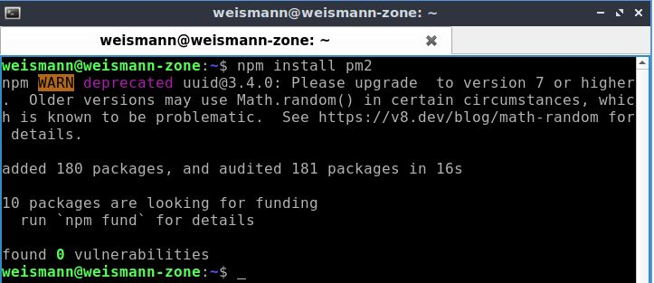  

    Verifikasi instalasinya

        pm2 -v
    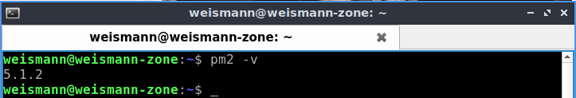  

2. Untuk menjalankannya lakukan perintah berikut pada script node.js :

        pm2 start <namafoldernode>/<app>
    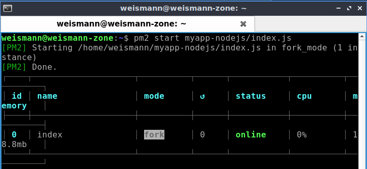  

3. Untuk stop service pm2 laukan perintah berikut :

        pm2 stop <namafoldernode>/<app>
    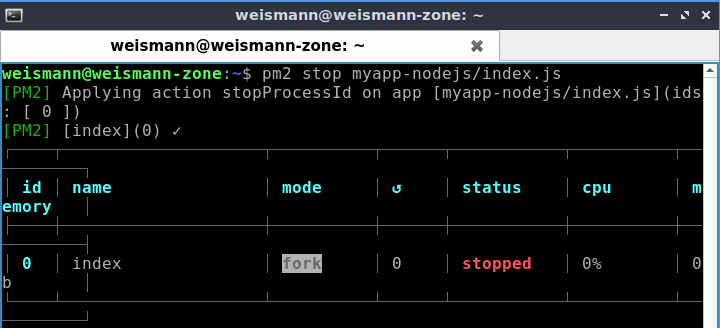
    
4. Anda juga bisa menggunakan pm2 untuk mengotomatiskan script python.

        pm2 start <namafolderpython>/<app>
    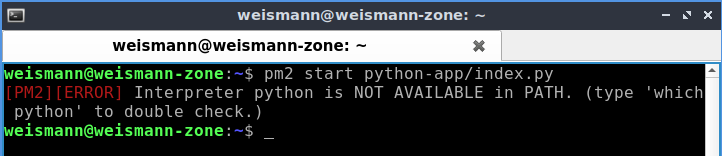  

    Namun, jika Anda memiliki beberapa versi Python yang diinstal di mesin Anda, Anda dapat memilih versi Python tertentu dengan --interpreter

        pm2 start <namafolderpython>/<app> --interpreter <versi-python>
    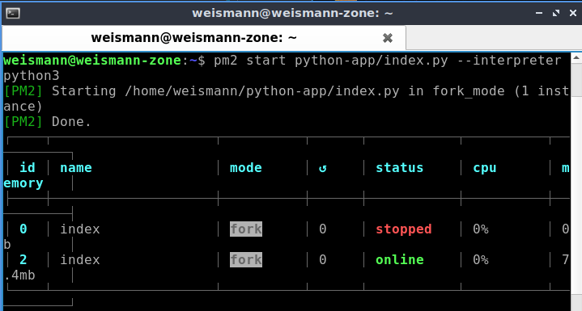  

    Jika Anda memiliki banyak pekerjaan untuk dijalankan, saya juga merekomendasikan untuk menamai setiap pekerjaan secara bermakna sehingga Anda tidak akan bingung nantinya. Contoh, pada kerjaan sebelumnya di node.js kita beri nama index, supaya berbeda di python kita beri nama python3.

        pm2 start <namafolderpython>/<app> --<name> --interpreter <versi-python>
    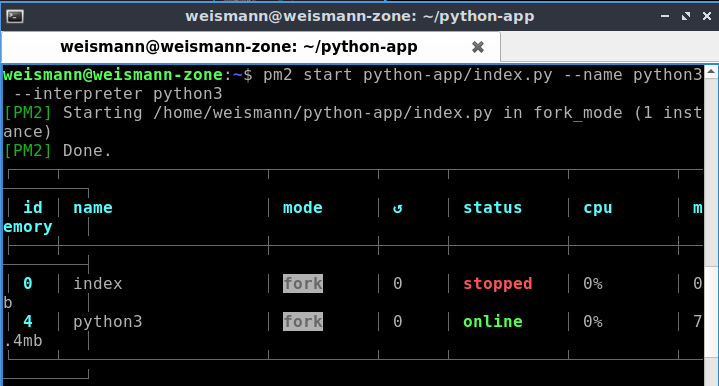  

5. Untuk melihat list service.

        pm2 list
    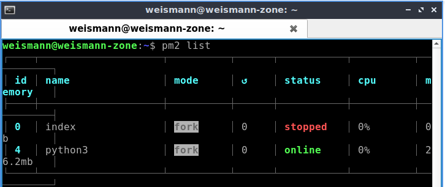  

6. Menghapus service.

        pm2 delete <namafolderpython>/<app>
    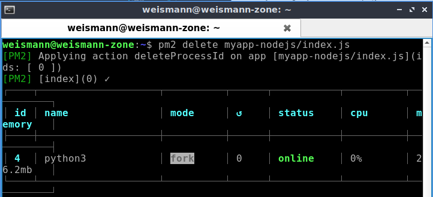  

7. Untuk melihat statusnya menggunakan

        pm2 status
    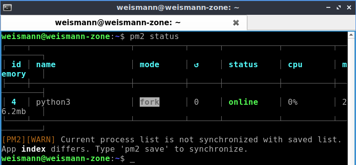  

8. Untuk Go sendiri Anda bisa menggunakan nohup.  

    Jalankan dahulu Go dalam kedaan dibuild.
        
        go build index.go
        ./index
    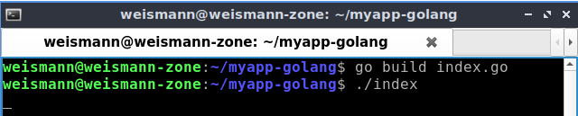  

    Lalu 

        nohup ./index &
    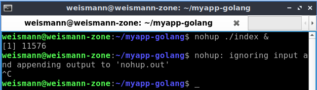  
    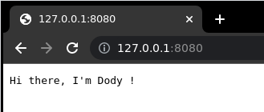  
