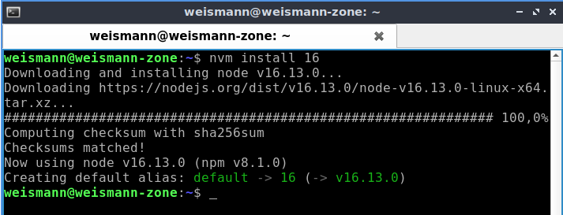
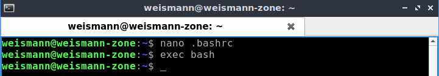

# **Membuat Simple Apps**

Berikut ini kita akan membuat aplikasi sederhana menggunakan node.js, python dan juga Go.

### **Node.js**

1. Langkah instalasi node.js, masukan perintah berikut ;

        curl -o- https://raw.githubusercontent.com/nvm-sh/nvm/v0.38.0/install.sh | bash
      

        jalankan exec bash dan cek versi nvmnya
      
        
    Install node nya

        nvm install 16 (versinya)
      

    Cek versi node dan npm

        node -v
        npm -v
      

        nvm use 16 (pilih versi nvm apabila install lebih dari satu versi)
      

2. Kemudian kita coba membuat aplikasi sederhananya.

        - buat folder baru : mkdir myapp-nodejs
        - masuk ke directory tersebut : cd myapp-nodejs/
        - buat file package.json : npm init -y
      
    
3. Install plugin express.

        npm install express --save
      

        Melihat isi package.jason : cat package.json
      

4. Buat file index.js

        nano index.js
    
    
    Lakukan perubahan config sesuai kebutuhan, misal di sini saya menuliskan kata Hello DumbWays, lalu simpan dan keluar dari nano.  

5. Jalankan aplikasi node.js

        node index.js (nama-aplikasi)
      
        

### **Python**

1. Pertama update dan upgrade sistem. Python sudah ada secara default tinggal cek saja : python3 -V.

        install package manager : sudo apt install python3-pip
      

2. Install flask.

        pip install flask
       

3. Buat sebuah folder dan file index.py

        mkdir python-app
      

        nano index.py
      

    Lakukan perubahan config sesuai kebutuhan, misal di sini saya menuliskan kata Welcome to DumbWays, lalu simpan dan keluar dari nano.  

4. Jalankan aplikasi python3

        python3 index.py (nama-aplikasi)
      
       

### **Go**

1. Download Go terlebih dahulu

        wget https://golang.org/dl/go1.17.3.linux-amd64.tar.gz && sudo su
      

    Ekstrak dan copy data

        rm -rf /usr/local/go && tar -C /usr/local -xzf go1.17.3.linux-amd64.tar.gz
      

    Masukkan path Go pada bashrc dan jalankan exec bash

        nano .bashrc
          
        
        exec bash
      

    Lakukan verifikasi installasi

        go version
      

2. Membuat aplikasi sederhana. Pertama buat sebuah folder.

        mkdir myapp-golang
      

    Pindah direktori dan buat sebuah file index.go.

        cd myapp-golang/
      

        nano index.go
      

    Lakukan perubahan config sesuai kebutuhan, misal di sini saya menuliskan kata Hi there, I'm Dody !, lalu simpan dan keluar dari nano.  

3. Jalankan aplikasi golang

        go run index.go

    Jika ingin dibuild

        go build index.go (nama-aplikasi)
        lalu jalankan : ./index
      

    